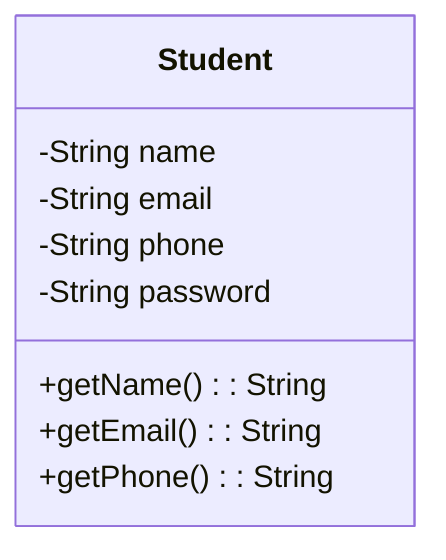
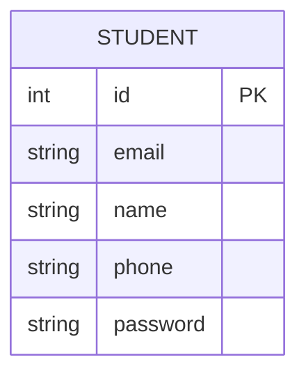

# LLD Design Round
```
1. Requirement
2. Clarity - Questions
3. Entities
4. Functionalities
```


# ReScaler - A case study

## Version 1
Following are the requirements of the ReScaler application:
* A student should be able to login with their email address and password.
* Students should be able to view their profile which includes their name, email address and phone number.

### Solution v1



### Database 


