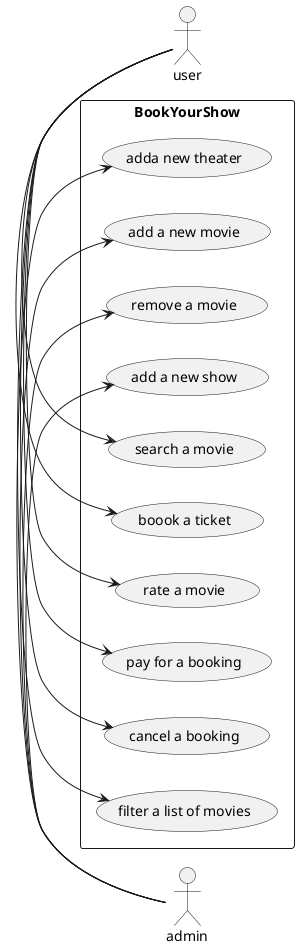
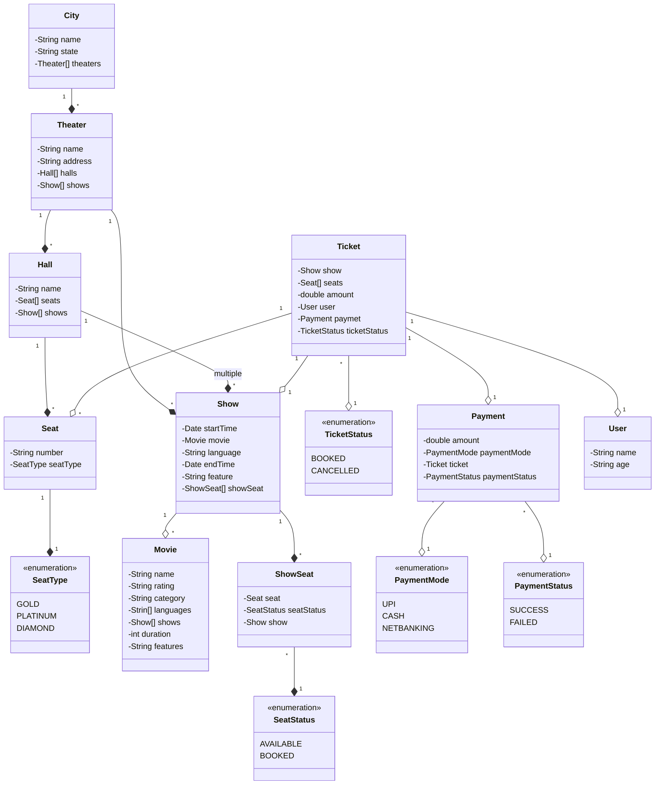

# Design BookMyShow

## Context

BookMyShow is India's biggest online movie and events ticketing brand. The website caters to ticket sales for movies,
plays, concerts and sporting events via the online platform.

BookMyShow is an online ticketing facility like Movietickets.com, Explara and Ticketmaster.com. BookMyShow took the
primary services provided by these two websites and consolidated it into one website for movies, plays, events and
sports tickets. Apart from being an online ticketing portal, BookMyShow offers information about upcoming movies and
events, show timings, venue details and artist bios.


## Requirements gathering

What are some questions you would ask to gather requirements?

```
1. Can a cinema hall have multiple screens/halls?
2. Can a movie be shown in multiple halls?
3. Can a movie be of multiple languages?
4. Can a user book multiple tickets for a single movie?
5. Are there multiple types of tickets?
6. How does user find a movie?
7. How does a user book a ticket?
8. How does a user pay for a ticket?
9. How does a new movie get added to the system?
10. Are there any discounts available?

```

## Requirements

Build an online movie ticket booking system that can support the following requirements:

- support for multiple `cities`
- each city will have multiple cinema `theaters`
- each cinema has multiple `halls`
- a cinema will play one `movie` at a time
- each hall can have multiple types for seat
    - GOLD
    - DIAMOND
    - PLATINUM
- allow the user to seacha movie by name
- allow the user to filter movies by the following fields
    - location
    - cinema
    - lang
    - rating
    - category
- each movie have multiple `shows`
- user can book `tickets` and pay via multiple `payment` methods
    - UPI
    - Credit Card
    - Netbanking
- a user can apply `coupone` or promo code at checkout
- price can be decided by multiple paramaters
    - seat type
    - day of the week
    - time of the day
    - cinema hall
- user can cancel or update `booking`
- a user cannot book or cancel ticker after cut off time that is 1 hr before movie

## Use case diagrams

Are the requirements clear enough to define use cases?
If not, try to think of the actors and their interactions with the system.

### Actors

What would be the actors in this system?

* Admin
* User

### Use cases

What would be the use cases i.e. the interactions between the actors and the system?

#### Actor 1

Name of actor - `admin`

Use cases:

```
- add a new movie
- add a new city
- add a nee show
```

#### Actor 2

Name of actor - `user`

Use cases:

```
- search a movie
- rate a movie
- book a ticket
- cancel a ticket
- pay for booking
```

---

Draw the use case diagram.



## Class diagrams

What will be the major classes and their attributes?

we cant attach status with the seat as it will book it for all shows as its a physical seat

* City
    * name
    * state
    * Theaters
* Theaters
    * name
    * address
    * Halls
    * Shows
    * lat/lng
* Hall
    * name
    * Seats
    * Shows
* Seat
    * number
    * SeatType - `gold` `platinum` `diamond`
* Show
    * start time
    * Movie
    * language
    * end time
    * features
    * showSeats
* Movie
    * name
    * rating
    * category
    * languages
    * Shows
    * duration
    * features
* ShowSeat
    * Seat
    * satus - `available` `booked`
    * price
* Ticket
    * Show
    * Seats - selected seats
    * amount
    * User
    * Payment
    * Status - `booked` `cancelled`
* Payment
    * amount
    * Mode - `UPI` `Cash` `Netbanking`
    * Ticket
    * Status - `success` `failed`
* User
    * name
    * age

```
```

Draw the class diagram.



## API design

What will be some APIs that you would design for this system?

Look at the use cases and try to design APIs for each of them.

You can simply write the APIs in the following format:
`API name` - `HTTP method` - `URL` - `?Request body` - `?Response body`

You could also use a tool like [Swagger](https://swagger.io/) to design the APIs or
follow [this](https://github.com/jamescooke/restapidocs) repository for a simple way to use Markdown to structure your
API documentation.