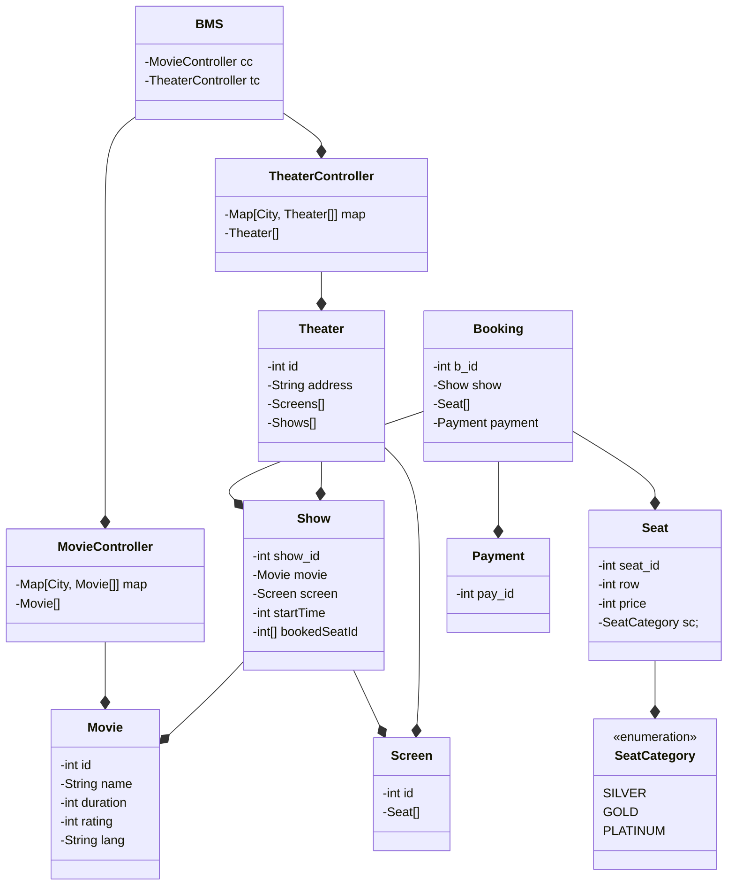

# Book my show LLD

## Entities and Attributes

- User
- Movie
- City
- Theater
- Screen
- Shows
- Seat
- Booking
- Payment

```mermaid
classDiagram
    class Movie {
        -int id
        -String name
        -int duration
        -int rating
        -String lang
    }

    class MovieController {
        -Map[City, Movie[]] map
        -Movie[]
    }

    class Theater {
        -int id
        -String address
        -Screens[]
        -Shows[]
    }
    class Screen {
        -int id
        -Seat[]
    }

    class Show {
        -int show_id
        -Movie movie
        -Screen screen
        -int startTime
        -int[] bookedSeatId
    }

    class Seat {
        -int seat_id
        -int row
        -int price
        -SeatCategory sc;
    }

    class SeatCategory {
        <<enumeration>>
        SILVER
        GOLD
        PLATINUM
    }

    class TheaterController {
        -Map[City, Theater[]] map
        -Theater[]
    }

    class Booking {
        -int b_id
        -Show show
        -Seat[]
        -Payment payment
    }

    class Payment {
        -int pay_id
    }

    class BMS {
        -MovieController cc
        -TheaterController tc
    }

    MovieController --* Movie
    TheaterController --* Theater
    Show --* Movie
    Show --* Screen
    Seat --* SeatCategory
    Booking --* Payment
    Booking --* Show
    Booking --* Seat
    Theater --* Screen
    Theater --* Show
    BMS --* MovieController
    BMS --* TheaterController
```