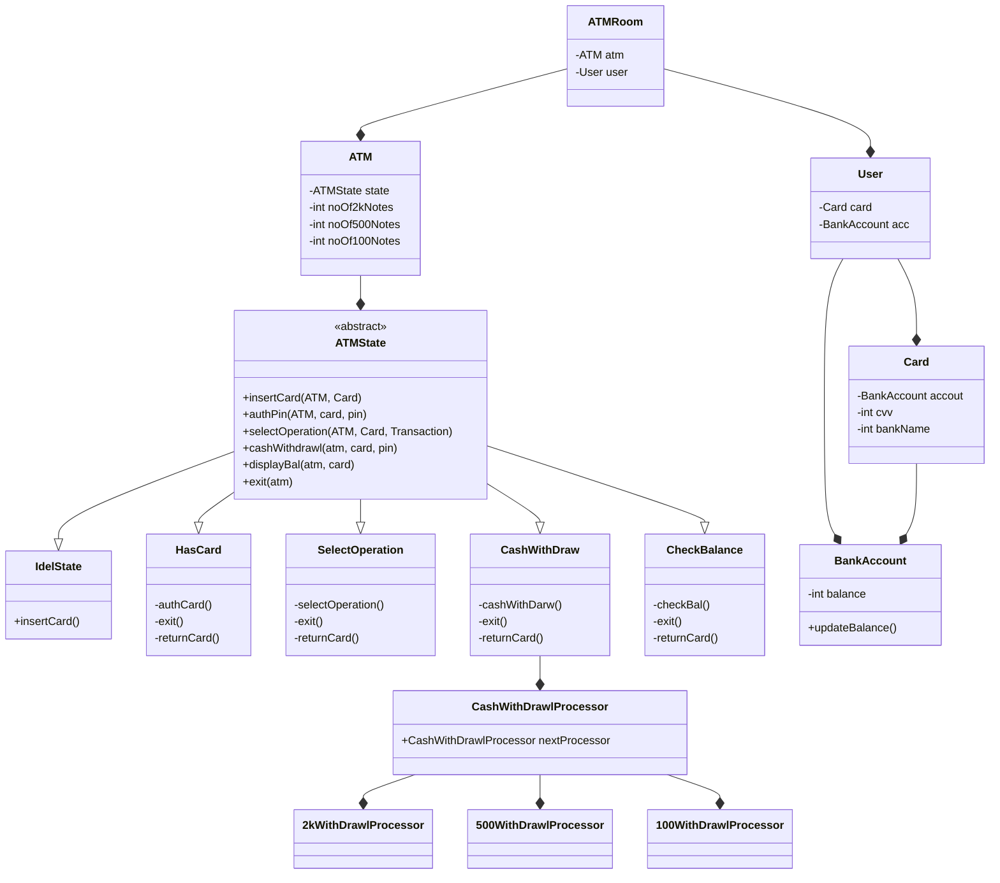

```mermaid
classDiagram
    class ATMState {
        <<abstract>>
        +insertCard(ATM, Card)
        +authPin(ATM, card, pin)
        +selectOperation(ATM, Card, Transaction)
        +cashWithdrawl(atm, card, pin)
        +displayBal(atm, card)
        +exit(atm)
    }
    class IdelState {
        +insertCard()
    }
    class HasCard {
        -authCard()
        -exit()
        -returnCard()
    }
    class SelectOperation {
        -selectOperation()
        -exit()
        -returnCard()
    }
    class CashWithDraw {
        -cashWithDarw()
        -exit()
        -returnCard()
    }
    class CheckBalance {
        -checkBal()
        -exit()
        -returnCard()
    }

    ATMState --|> IdelState
    ATMState --|> HasCard
    ATMState --|> SelectOperation
    ATMState --|> CashWithDraw
    ATMState --|> CheckBalance

    class ATM {
        -ATMState state
        -int noOf2kNotes
        -int noOf500Notes
        -int noOf100Notes
    }
    class User {
        -Card card
        -BankAccount acc
    }
    class Card {
        -BankAccount accout
        -int cvv
        -int bankName
    }
    class BankAccount {
        -int balance
        +updateBalance()
    }

    class ATMRoom {
        -ATM atm
        -User user
    }

    ATMRoom --* ATM
    ATMRoom --* User
    User --* Card
    User --* BankAccount
    Card --* BankAccount
    ATM --* ATMState

    class CashWithDrawlProcessor {
        +CashWithDrawlProcessor nextProcessor
    }
    class 2kWithDrawlProcessor {
    }
    class 500WithDrawlProcessor {
    }
    class 100WithDrawlProcessor {
    }

    CashWithDrawlProcessor --* 2kWithDrawlProcessor
    CashWithDrawlProcessor --* 500WithDrawlProcessor
    CashWithDrawlProcessor --* 100WithDrawlProcessor
    CashWithDraw --* CashWithDrawlProcessor
```