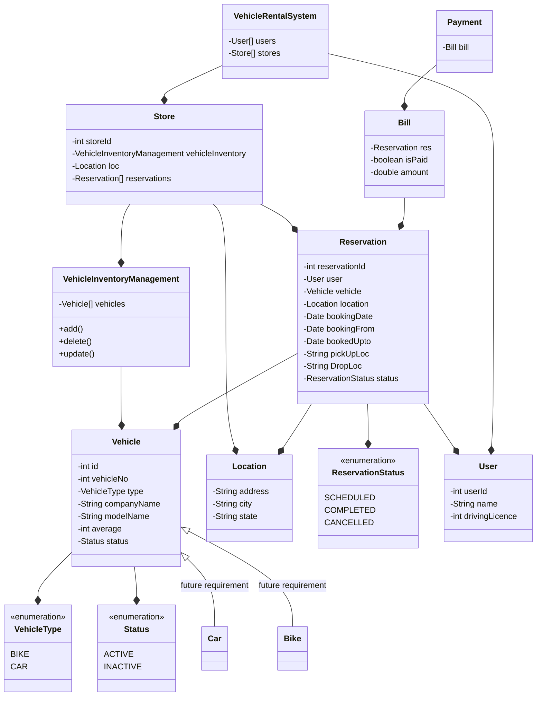

## Car Rental system LLD

### Requirements

### Objects
* User
* Location
* Store
* Vehicles
* Reserve
* Bill
* Payment

```mermaid
classDiagram
    class Vehicle {
        -int id
        -int vehicleNo
        -VehicleType type
        -String companyName
        -String modelName
        -int average
        -Status status
    }

    class VehicleType {
        <<enumeration>>
        BIKE
        CAR
    }

    class Status {
        <<enumeration>>
        ACTIVE
        INACTIVE
    }

    Vehicle --* VehicleType
    Vehicle --* Status

    class Car {
    }
    class Bike {
    }

    Vehicle <|-- Car: future requirement
    Vehicle <|-- Bike: future requirement

    class Store {
        -int storeId
        -VehicleInventoryManagement vehicleInventory
        -Location loc
        -Reservation[] reservations
    }

    class Location {
        -String address
        -String city
        -String state
    }

    class VehicleInventoryManagement {
        -Vehicle[] vehicles
        +add()
        +delete()
        +update()
    }

    class Reservation {
        -int reservationId
        -User user
        -Vehicle vehicle
        -Location location
        -Date bookingDate
        -Date bookingFrom
        -Date bookedUpto
        -String pickUpLoc
        -String DropLoc
        -ReservationStatus status
    }

    class ReservationStatus {
        <<enumeration>>
        SCHEDULED
        COMPLETED
        CANCELLED
    }

    class User {
        -int userId
        -String name
        -int drivingLicence
    }
    VehicleInventoryManagement --* Vehicle
    Store --* VehicleInventoryManagement
    Store --* Location
    Store --* Reservation
    Reservation --* Vehicle
    Reservation --* User
    Reservation --* Location
    Reservation --* ReservationStatus

    class VehicleRentalSystem {
        -User[] users
        -Store[] stores
    }
    
    VehicleRentalSystem --* User
    VehicleRentalSystem --* Store

    class Bill {
        -Reservation res
        -boolean isPaid
        -double amount
    }

    class Payment {
        -Bill bill
    }

    Bill --* Reservation
    Payment --* Bill

```