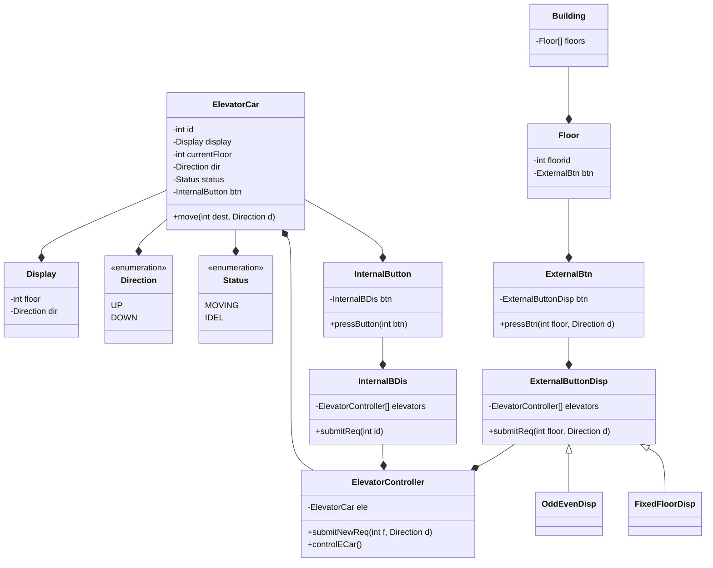

```mermaid
classDiagram
    class Display {
        -int floor
        -Direction dir
    }

    class ElevatorCar {
        -int id
        -Display display
        -int currentFloor
        -Direction dir
        -Status status
        -InternalButton btn
        +move(int dest, Direction d)
    }

    class Direction {
        <<enumeration>>
        UP
        DOWN
    }

    class Status {
        <<enumeration>>
        MOVING
        IDEL
    }

    ElevatorCar --* Display
    ElevatorCar --* Direction
    ElevatorCar --* Status

    class InternalButton {
        -InternalBDis btn
        +pressButton(int btn)
    }

    class ElevatorController {
        -ElevatorCar ele
        +submitNewReq(int f, Direction d)
        +controlECar()
    }

    ElevatorController --* ElevatorCar

    class ExternalBtn {
        -ExternalButtonDisp btn
        +pressBtn(int floor, Direction d)
    }
    class ExternalButtonDisp {
        -ElevatorController[] elevators
        +submitReq(int floor, Direction d)
    }
    ExternalBtn --* ExternalButtonDisp

    class OddEvenDisp {
    }

    class FixedFloorDisp {
    }

    ExternalButtonDisp <|-- OddEvenDisp
    ExternalButtonDisp <|-- FixedFloorDisp
    ExternalButtonDisp --* ElevatorController

    class InternalBDis {
        -ElevatorController[] elevators
        +submitReq(int id)
    }

    InternalButton --* InternalBDis
    InternalBDis --* ElevatorController

    class Floor {
        -int floorid
        -ExternalBtn btn
    }

    class Building {
        -Floor[] floors
    }
    Building --* Floor
    Floor --* ExternalBtn
    ElevatorCar --* InternalButton

```

## Algorithm 

LOOK algorithm - 