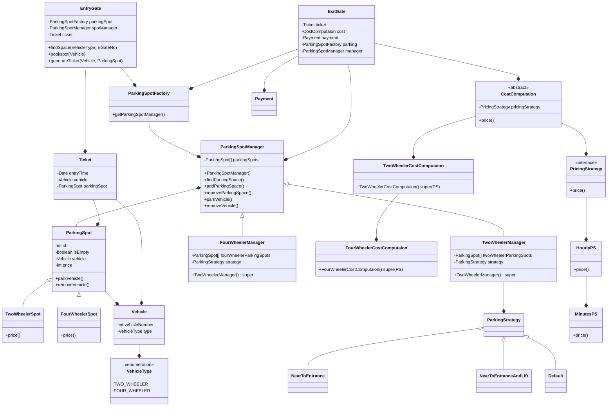

## Parking lot LLD

```mermaid
classDiagram
    class ParkingSpot {
        -int id
        -boolean isEmpty
        -Vehicle vehicle
        -int price
        +parkVehicle()
        +removeVehicle()
    }

    class TwoWheelerSpot {
        +price()
    }
    class FourWheelerSpot {
        +price()
    }

    ParkingSpot <|-- TwoWheelerSpot
    ParkingSpot <|-- FourWheelerSpot

    class ParkingSpotManager {
        -ParkingSpot[] parkingSpots
        +ParkingSpotManager()
        +findParkingSpace()
        +addParkingSpace()
        +removeParkingSpace()
        +parkVehicle()
        +removeVehicle()
    }

    ParkingSpotManager *-- ParkingSpot

    class TwoWheelerManager {
        -ParkingSpot[] twoWheelerParkingSpots
        -ParkingStrategy strategy
        +TwoWheelerManager() super
    }

    class FourWheelerManager {
        -ParkingSpot[] fourWheelerParkingSpots
        -ParkingStrategy strategy
        +TwoWheelerManager() super
    }

    ParkingSpotManager <|-- TwoWheelerManager
    ParkingSpotManager <|-- FourWheelerManager

    class ParkingStrategy {
    }

    class NearToEntrance {
    }
    class NearToEntranceAndLift {
    }
    class Default {
    }

    class Vehicle {
        -int vehicleNumber
        -VehicleType type
    }

    class VehicleType {
        <<enumeration>>
        TWO_WHEELER
        FOUR_WHEELER
    }

    ParkingSpot --* Vehicle
    Vehicle --* VehicleType

    class Ticket {
        -Date entryTime
        -Vehicle vehicle
        -ParkingSpot parkingSpot
    }
    
    Ticket --* ParkingSpot
    Ticket --* Vehicle

    class EntryGate {
        -ParkingSpotFactory parkingSpot
        -ParkingSpotManager spotManager
        -Ticket ticket
        +findSpace(VehicleType, EGateNo)
        +bookspot(Vehicle)
        +generateTicket(Vehicle, ParkingSpot)
    }

    class ParkingSpotFactory {
        +getParkingSpotManager()
    }

    EntryGate --* Ticket
    EntryGate --* ParkingSpotFactory
    ParkingSpotFactory --* ParkingSpotManager

    class ExitGate {
        -Ticket ticket
        -CostComputaion cost
        -Payment payment
        -ParkingSpotFactory parking
        -ParkingSpotManager manager
    }

    class CostComputaion {
        <<abstract>>
        -PricingStrategy pricingStrategy
        +price()
    }
    class TwoWheelerCostComputaion {
        +TwoWheelerCostComputaion() super(PS)
    }
    class FourWheelerCostComputaion {
        +FourWheelerCostComputaion() super(PS)
    }

    CostComputaion --* TwoWheelerCostComputaion
    TwoWheelerCostComputaion --* FourWheelerCostComputaion

    class PricingStrategy {
        <<interface>>
        +price()
    }
    class HourlyPS {
        +price()
    }
    class MinutesPS {
        +price()
    }

    CostComputaion --* PricingStrategy
    PricingStrategy --* HourlyPS
    HourlyPS --* MinutesPS
    ExitGate --* CostComputaion

    class Payment {
    }

    ExitGate --* Payment
    ExitGate --* ParkingSpotManager
    ExitGate --* ParkingSpotFactory
    ParkingStrategy <|-- NearToEntrance
    ParkingStrategy <|-- NearToEntranceAndLift
    ParkingStrategy <|-- Default
    TwoWheelerManager --* ParkingStrategy

```