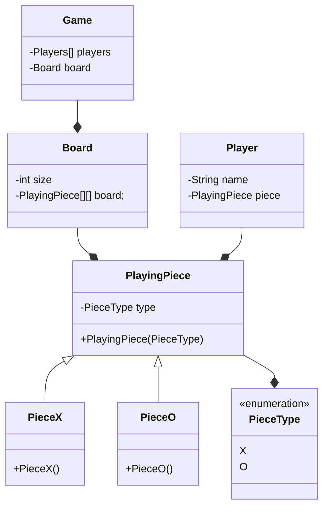

## TIC-TAC-TOA LLD

```mermaid
classDiagram
    class PlayingPiece {
        -PieceType type
        +PlayingPiece(PieceType)
    }
    class PieceX {
        +PieceX()
    }
    class PieceO {
        +PieceO()
    }
    PlayingPiece <|-- PieceX
    PlayingPiece <|-- PieceO

    class PieceType {
        <<enumeration>>
        X
        O
    }
    PlayingPiece --* PieceType

    class Board {
        -int size
        -PlayingPiece[][] board;
    }

    class Player {
        -String name
        -PlayingPiece piece
    }

    class Game {
        -Players[] players
        -Board board
    }

    Board --* PlayingPiece
    Player --* PlayingPiece
    Game --* Board
```