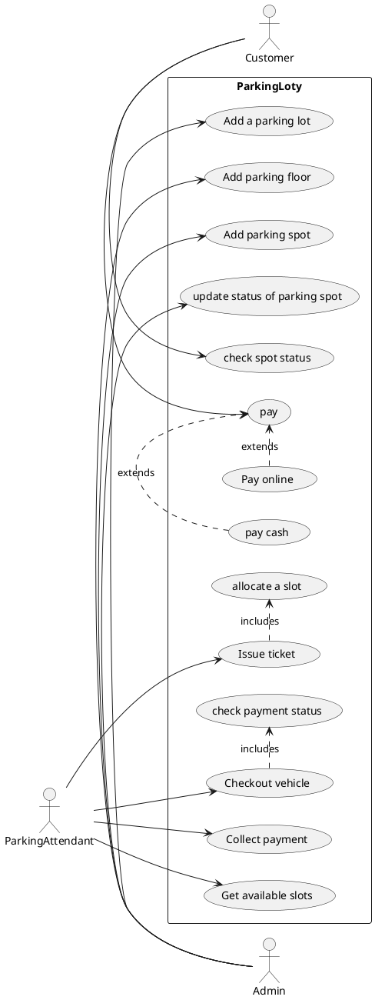
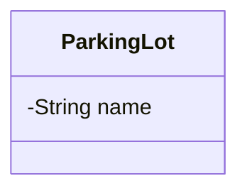

# Design a parking lot

> A parking lot or car park is a dedicated cleared area that is intended for parking vehicles. In most countries where
> cars are a major mode of transportation, parking lots are a feature of every city and suburban area. Shopping malls,
> sports stadiums, megachurches, and similar venues often feature parking lots over large areas
[Reference](https://github.com/tssovi/grokking-the-object-oriented-design-interview/blob/master/object-oriented-design-case-studies/design-a-parking-lot.md)


> Parking lot is an open area designated for parking cars. We will design a parking lot where a certain number of cars
> can be parked for a certain amount of time. The parking lot can have multiple floors where each floor carries multiple
> slots. Each slot can have a single vehicle parked in it.
[Reference](https://medium.com/double-pointer/system-design-interview-parking-lot-system-ff2c58167651)


## Requirements gathering

What are some questions you would ask to gather requirements?

```
1. can a parking lot have multiple floors 
2. can a parking lot have multiple entrance
3. can a parking lot have multiple exits
4. can a parking lot have multiple types of vechile
5. can we park any type on vechile in any slot
6. how do we get a ticket
7. how do we know if a slot is empty
8. different modes of payment
9. how to pay for parking 
10. how to allocate a slot
```

## Requirements

Build an online parking lot management system that can support the following requirements:

* Should have multiple floors.
* Multiple entries and exit points.
* A person has to collect a ticket at entry and pay at or before exit.
* Pay at:
    * Exit counter (Cash to the parking attendant)
    * Dedicated automated booth on each floor
    * Online
* Pay via:
    * Cash
    * Credit Card
    * UPI
* Allow entry for a vehicle if a slot is available for it. Show on the display at entry if a slot is not available.
* Parking Spots of 3 types:
    * Large
    * Medium
    * Small
* A car can only be parked at its slot. Not on any other (even larger).
* A display on each floor with the status of that floor.
* Fees calculated based on per hour price: e.g. 50 rs for the first hour, then 80 rs per extra hour.
    * Small - 50, 80
    * Medium - 80, 100
    * Large - 100, 120

## Use case diagrams

Are the requirements clear enough to define use cases?
If not, try to think of the actors and their interactions with the system.

### Actors

What would be the actors in this system?

```
1. Parking attendant
2. customer
3. admin
```

### Use cases

What would be the use cases i.e. the interactions between the actors and the system?

#### Actor 1

Name of the actor - `Admin `

Use cases:

```
1. create a parking lot
2. create a parking floor
3. add new parking spots
4. update status of a parking spot
```

#### Actor 2

Name of the actor - `parking attendent `
Use cases:

```
1. check empty slots
2. issue a ticket
3. collect payment
4. checkout vechile
```

#### Actor 3

Name of the actor - `customer `
Use cases:

```
1. collected ticket
2. do payment
3. check status - empty slots
4. check price
```

Add more actors and their use cases as needed.

**Create a use case diagram for the system.**



## API design

What will be some APIs that you would design for this system?

Look at the use cases and try to design APIs for each of them.

You can simply write the APIs in the following format:
`API name` - `HTTP method` - `URL` - `?Request body` - `?Response body`

You could also use a tool like [Swagger](https://swagger.io/) to design the APIs or
follow [this](https://github.com/jamescooke/restapidocs) repository for a simple way to use Markdown to structure your
API documentation.

### APIs for Actor 1

#### APIs Category 1

```markdown
* `API name` - `HTTP method` - `URL` - `?Request body` - `?Response body`
```

### APIs for Actor 2

#### APIs Category 1

```markdown
* `API name` - `HTTP method` - `URL` - `?Request body` - `?Response body`
```

### APIs for Actor 3

#### APIs Category 1

```markdown
* `API name` - `HTTP method` - `URL` - `?Request body` - `?Response body`
```

## Class diagram

What will be the major classes and their attributes?

* ParkingLot
    * name
    * address
    * parking floors
    * entry gates
    * exit gates
    * display board
* ParkingFloor
    * floor number
    * parking spot
    * display board
    * payment counter
* ParkingSpot
    * status - `occupied , available, out of order`
    * spot type - `small , medium, large`
* ParkingTicket
    * start time
    * vehicle
    * parking spot
    * entry gate
    * parking attendant
* Invoice
    * exit time
    * amount
    * parking ticket
    * payment
* Payment
    * amount
    * invoice
    * mode - `cash,credit,UPI`
    * status - `pending , done`
    * time
* Vehicle
    * type - `car,bike,truck`
    * vehicle number
* Display Board
* Payment Counter
* Entry Gate
    * parking attendant
    * displayboard
* Exit Gate
    * payment counter
    * parking attendant

## List down the cardinalities of the relationships between the classes.

* `ParkingLot` - `ParkingFloor` - One to many
* `ParkingLot` - `ParkingGate` - `entryGates` - One to many
* `ParkingLot` - `ParkingGate` - `exitGates` - One to many
* `ParkingFloor` - `ParkingSpot` - One to many
* `Invoice` - `Payment` - One to One
* `ParkingGate` - `ParkingAttendant` - `currentGate` - One to one
* `ParkingSpot` - `ParkingTicket` - One to many
* `ParkingTicket` - `Invoice` - One to one
* `ParkingTicket` - `Vehicle` - Many to one
* `ParkingTicket` - `ParkingSpot` - Many to one
* `Payment` - `ParkingTicket` - One to one

Draw the class diagram.


