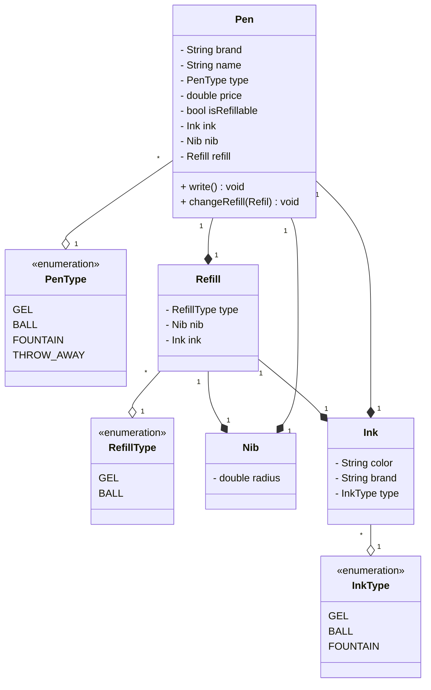
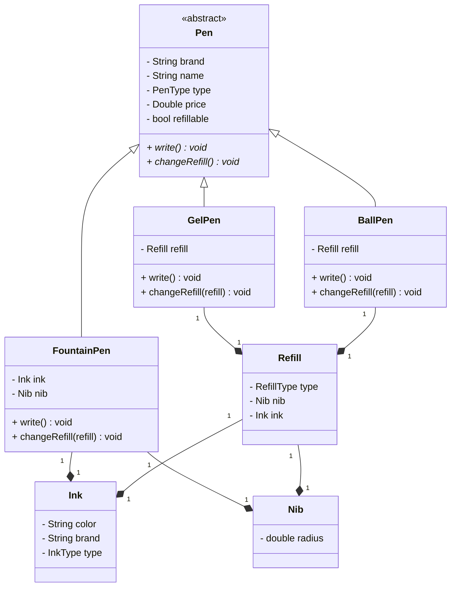

# Design a pen

## Steps

```
- context / overview
- Ask questions
    - current requirements
    - future requirements
    - behaviore 
    
```

## Gather requirements

```
- A pen is anything that can write
- types of pen - gel, ball, fountain, marker, throwaway pen
- ball pen have ball pen refil gel pen will have gel pen refil
- refil has a tip and an ink
- ink can be of diff colors
- fountain pen has a ink
- refil has a radius. for fountain pen, its tip has a radius
- each pen can write in diff way
- some pen write in the same way
- every pen has a brand and a name
- some pens allow refilling while others might not
```

## Entities and attributes

```
* Pen
    * Brand
    * Name
    * Type - Ball, Gel, Fountain, Marker, Throwaway pen
    * Price
    * Refillable
    
* Refil
    * Type - Gel, Ball
    * Ink
    * Nib
    * Refillable
    
*Ink
    * Coor
    * Brand
    * Type - Gell, Ball, Fountain
    
*Nib
    * radius
    * type - gold, silver, platinum    
```

### Different types of pens

```
* Gel Pen
    * type - gel
    * refillable - yes
    * refill
        * type - gel
        * refillable - yes
    * ink
    * nib
    
* Throwaway Pen
    * type - gel
    * refillable - no
    * refill
        * type - gel
        * refillable - no
    * ink
    * nib

* fountain pen
    * type - fountain
    * refillable - yes
    * ink
    * nib
    
    
```

### V1 - Single class



## Problems
```
- Single Responsibility Principle is violated. There are multiple reasons to change the class such as modifying a single type of pen.
- Open Closed Principle is violated. Adding a new type of pen requires changing the class.
- Null checks are required for handling refill and ink for fountain pens.
- Object creation is complex
- duplication
```
## V2 - Multiple class 

