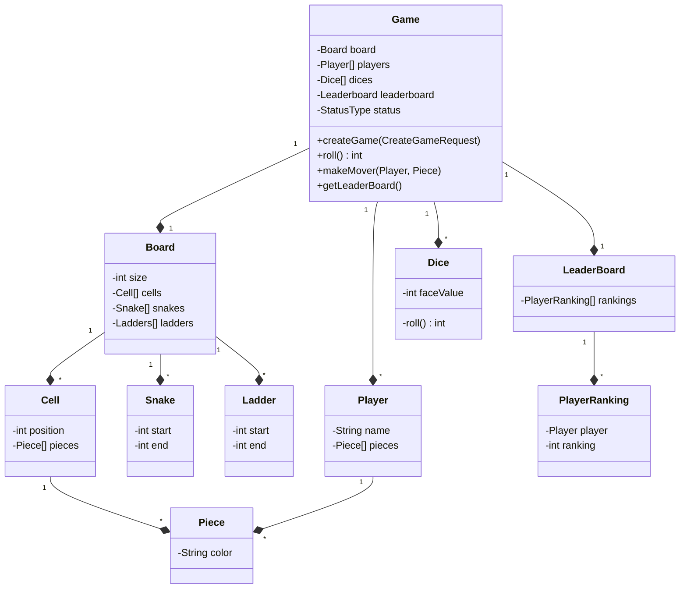
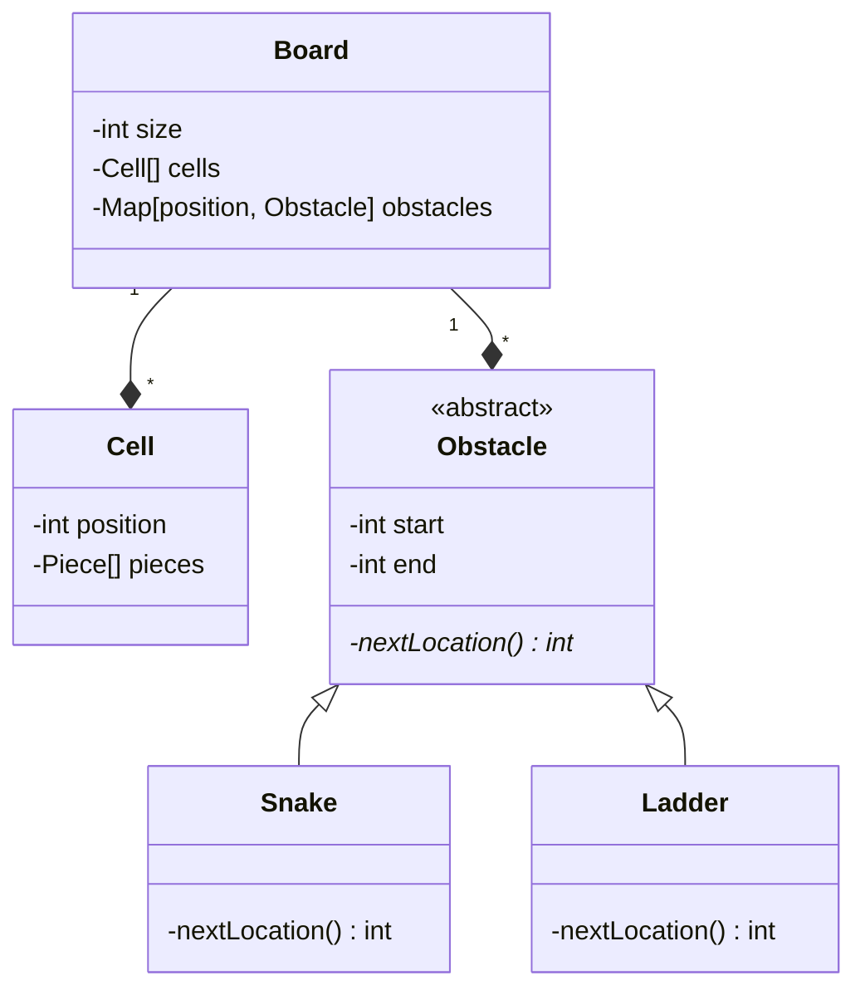
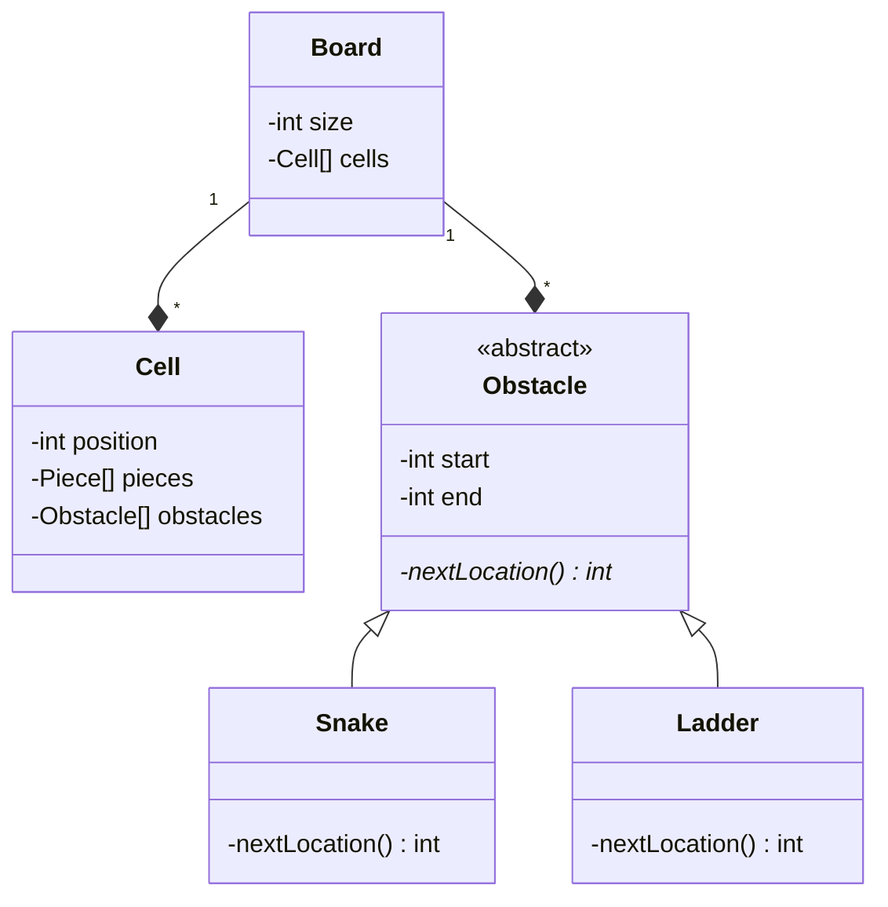
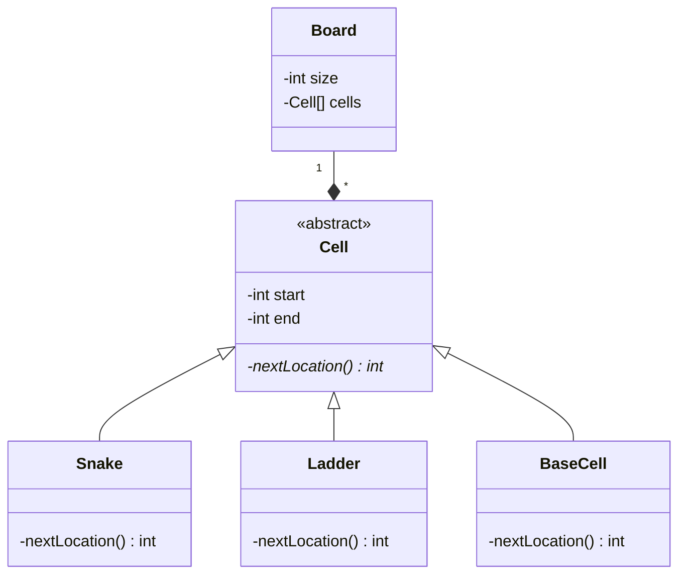

# Design Snakes and Ladders

## Requirements
```
1. A game can be between multiple players 
2. a game will only have human players
3. each player can have multiple pieces
4. a board can be of any size decided by the client
5. a board will have different types ofcells
6. there can be normal cells and cells which contains snake and ladders
7. position of snakes and ladders is random or decided at the start of the game
8. the number of snakes and ladders is random or decided at the start of the game
9. the size of ladder and snake is random or decided at the start of the game
10. a player will move according to dice
11. a player will enter the game only when he gets one or max num in the dice
12. a player will win if they reach the last cell
13. the game will end when n-1 players reach the last cell
14. for each game maintain a leaderboard which has the rankings of each player
```
## Entities and their attributes
- Game
  - Board
    - Dimensions
    - Cells
      - position
      - pieces
      - type ?
    - snake
      - start
      - end
    - ladder
      - start
      - end
  - Players
    - pieces
    - name
  - Dices
  - LeaderBoard
    - players
    - ranking
  - Status

## initial design


### Problems with initial design
* OCP violation in the board class
* No parent class for special cells to reduce code duplication

## Adding a new parent class for snake and ladder



## optimization - moving obstacle to cell


### Problem
- so many null check in case of empty cell

## optimizing sol - adding an empty cell to obstacle hierarchy


```