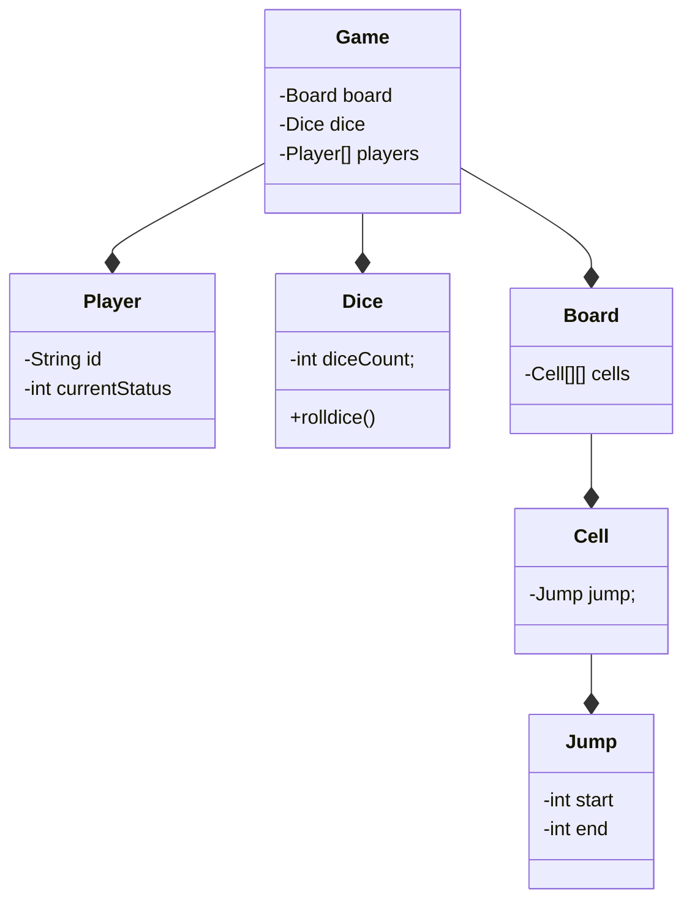

```mermaid
classDiagram
    class Player {
        -String id
        -int currentStatus
    }
    class Dice {
        -int diceCount;
        +rolldice()
    }
    class Jump {
        -int start
        -int end
    }
    class Board {
        -Cell[][] cells
    }
    class Cell {
        -Jump jump;
    }
    class Game {
        -Board board
        -Dice dice
        -Player[] players
    }

    Board --* Cell
    Game --* Board
    Game --* Dice
    Game --* Player
    Cell --* Jump


```