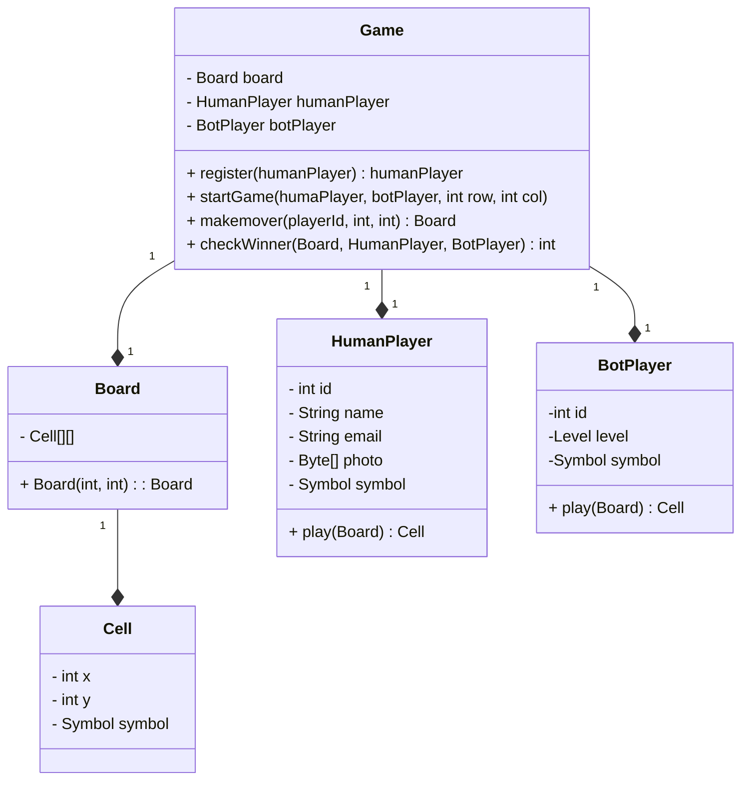
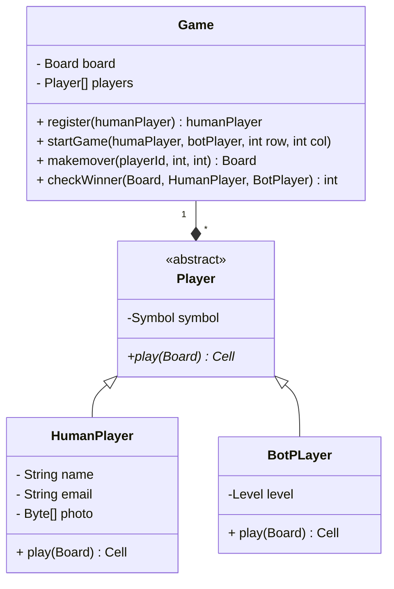
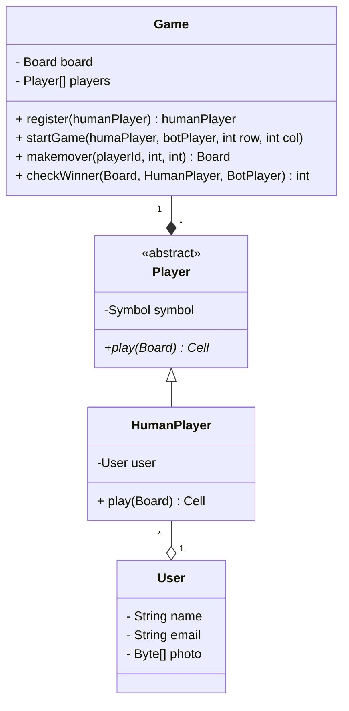
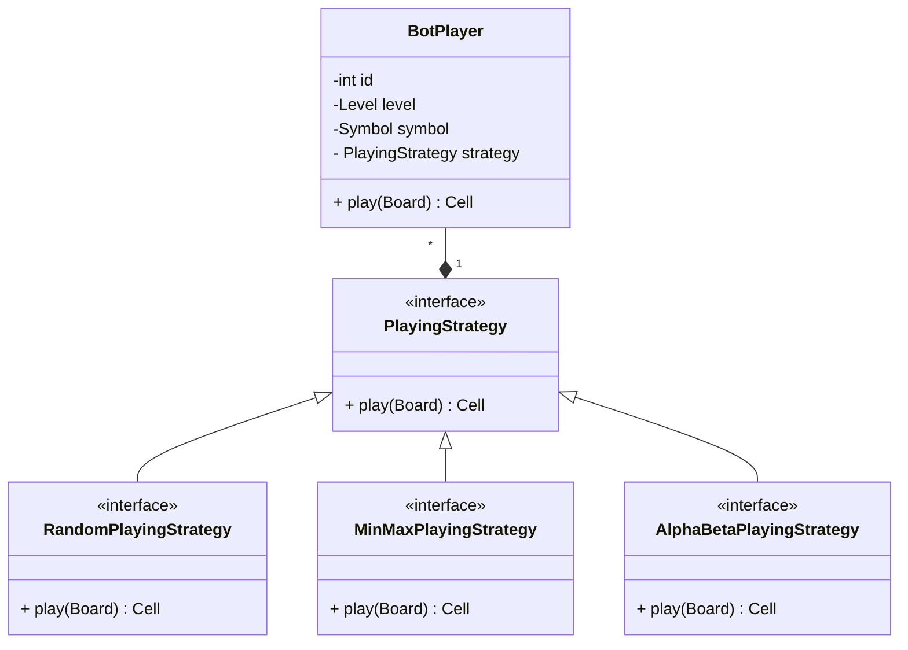
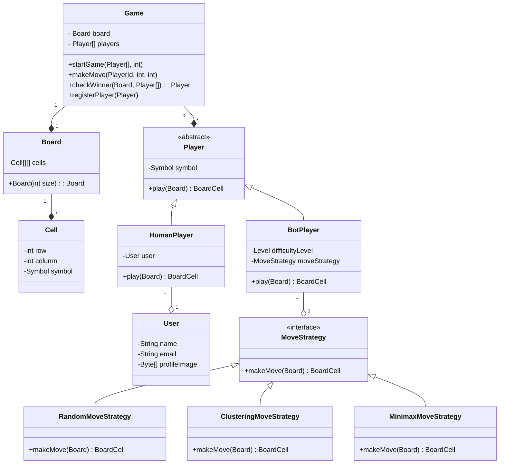

# Design Tic-Tac-Toe

## What is tic tac toe

TicTacToe is a 2 player game played on a 3 x 3 board. Each player is allotted a symbol (one X and one O).
Initially, the board is empty. Alternatively, each player takes a turn and puts their symbol at any
empty slot. The first player to get their symbol over a complete row OR a complete column OR a diagonal wins.

## Problem statement

- design a tic tac toe

## Question to ask

- Current scope
    - size of the board
    - 2 player or more
- Future Scope
    - can there be multiple ways to win the game
- Behaviour
    - can a player play with a bot
    - how does a player win
    - who start the game

## Requirements clarification

- Board can be of any NxN size.
- There can be two players.
- Each player will be allotted a symbol.
- The symbol can be one of O and X.
- The players can be either humans or bots.
- Each human player will have a name, email and profile image.
- Each bot player will have a difficulty level.
- Any random player can start the game.
- Then the players will take turns alternatively.
- The player with any consecutive N symbols in a row, column or diagonal wins.
- If the board is full and no player has won, the game is a draw.
- CLI or API

## Entities and attributes

- Game
    - Board
    - players
        - humar / bot
- Board
    - cells[][]
- Cell
    - x,y (row , col)
    - symbol - O,X
- Human
    - name
    - email
    - photo
- Bot
    - level

## Behaviors

- Start theb game
- checkwinner
- makemove
- register

## Class Diagram

### version 1

## Problems

- The Game class is tightly coupled with the HumanPlayer and BotPlayer classes. It is not extensible to support any
  other type of player and number of players.
- There is no common contract for the players.
- Huge memory consumption - A player can play multiple games at the same time. Each will have a new HumanPlayer object.
  Each player object will have the profile image. This will consume a lot of memory.
- Implementing the play method for the bot player will lead to SRP and OCP violations because it will be deciding the
  move based on the difficulty level. This will lead to a lot of if-else conditions.

## version 2

## Problems

- ~~The Game class is tightly coupled with the HumanPlayer and BotPlayer classes. It is not extensible to support any
  other type of player and number of players.~~
- ~~There is no common contract for the players.~~
- Huge memory consumption - A player can play multiple games at the same time. Each will have a new HumanPlayer object.
  Each player object will have the profile image. This will consume a lot of memory.
- Implementing the play method for the bot player will lead to SRP and OCP violations because it will be deciding the
  move based on the difficulty level. This will lead to a lot of if-else conditions.

## version 3 - solving memory consumption

## Problems

- ~~The Game class is tightly coupled with the HumanPlayer and BotPlayer classes. It is not extensible to support any
  other type of player and number of players.~~
- ~~There is no common contract for the players.~~
- ~~Huge memory consumption - A player can play multiple games at the same time. Each will have a new HumanPlayer object.
  Each player object will have the profile image. This will consume a lot of memory.~~
- Implementing the play method for the bot player will lead to SRP and OCP violations because it will be deciding the
  move based on the difficulty level. This will lead to a lot of if-else conditions.

## version 4 - using strategy design pattern

## final version
