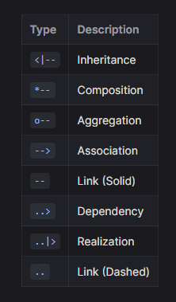
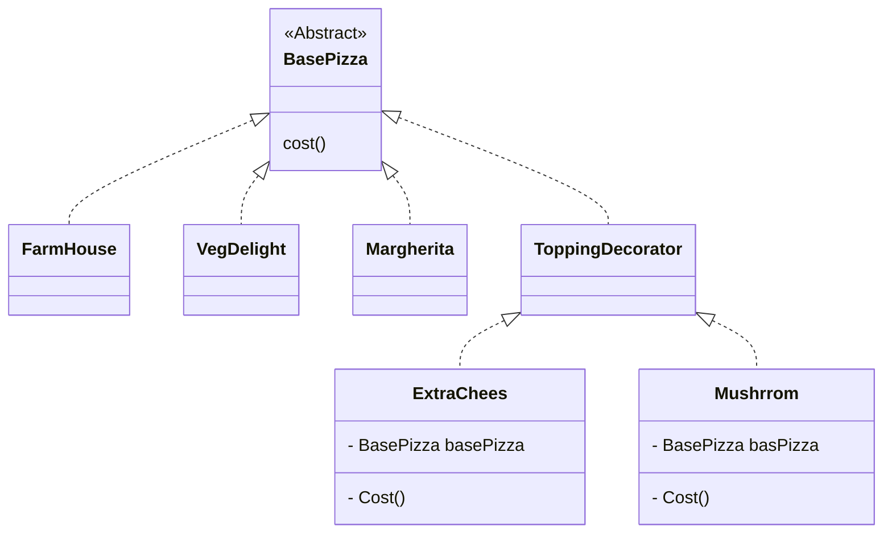

## Decorator Pattern

### Class Diagram

```mermaid
classDiagram
    BasePizza <|.. FarmHouse
    BasePizza <|.. VegDelight
    BasePizza <|.. Margherita
    BasePizza <|.. ToppingDecorator

    class BasePizza {
        <<Abstract>>
        cost()
    }

    ToppingDecorator <|.. ExtraChees
    ToppingDecorator <|.. Mushrrom

    class ExtraChees {
        - BasePizza basePizza
        - Cost()
    }

    class Mushrrom {
        - BasePizza basPizza
        - Cost()
    }


```