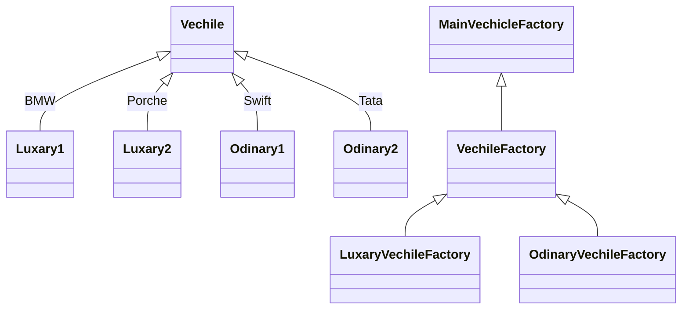

## Factory

Factory DP is used when we want to create an object on the basics of some parameters

```
1. crate a common interface
2. create a concrete class 
3. create a factory class  
    - which return the instance of that based on some condition
    
```

### Abstract Factory

similar to factort pattern but has factory of factories

