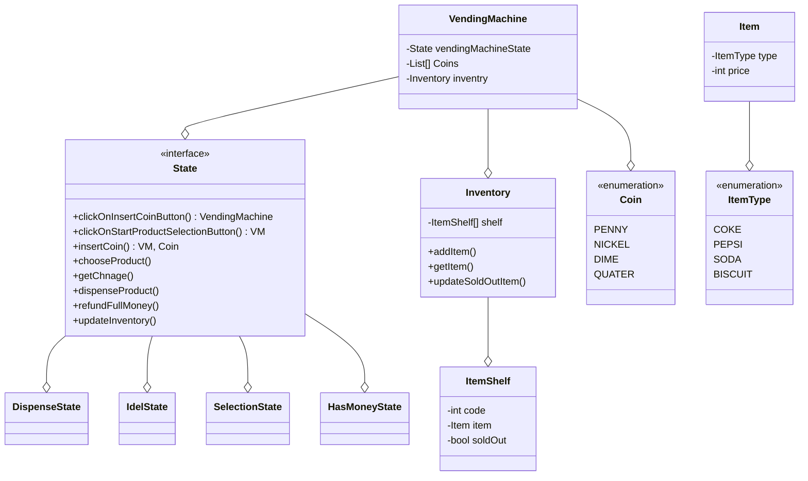

## UML diagram of vending machine

```mermaid
classDiagram
    class VendingMachine {
        -State vendingMachineState
        -List[] Coins
        -Inventory inventry
    }

    class Coin {
        <<enumeration>>
        PENNY
        NICKEL
        DIME
        QUATER
    }

    class Inventory {
        -ItemShelf[] shelf
        +addItem()
        +getItem()
        +updateSoldOutItem()
    }

    class ItemShelf {
        -int code
        -Item item
        -bool soldOut
    }

    class Item {
        -ItemType type
        -int price
    }

    class ItemType {
        <<enumeration>>
        COKE
        PEPSI
        SODA
        BISCUIT
    }

    class State {
        <<interface>>
        +clickOnInsertCoinButton() VendingMachine
        +clickOnStartProductSelectionButton() VM
        +insertCoin() VM, Coin
        +chooseProduct()
        +getChnage()
        +dispenseProduct()
        +refundFullMoney()
        +updateInventory()
    }

    class DispenseState {
    }
    class IdelState {
    }
    class HasMoneyState {
    }
    class SelectionState {
    }

    VendingMachine --o State
    VendingMachine --o Inventory
    VendingMachine --o Coin
    Inventory --o ItemShelf
    Item --o ItemType
    State --o DispenseState
    State --o IdelState
    State --o SelectionState
    State --o HasMoneyState


```