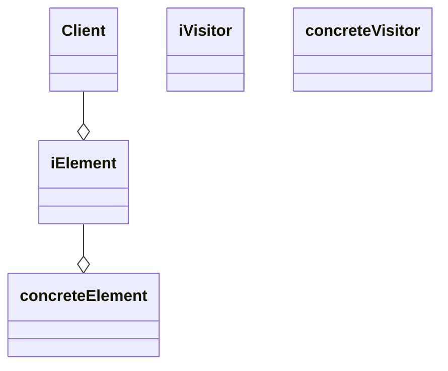

- allows you to add new operations to existing class without changing their structure
- seperate operation out of class

```mermaid
classDiagram
    class Client {
        
    }
    
    class iElement {
        
    }
    class iVisitor {
        
    }
    class concreteElement {
        
    }
    class concreteVisitor {
        
    }
    
    Client --o iElement
    iElement --o concreteElement
```

- element = any object on which u want to do oprations
-   