# Design a Parking Lot Management System

### Rhough flow

```
vechile (entrance gate) --> parking slot --> exit --> vechile out
     ticket                                    payment
```

### Gather Requirements

```
1. How many entrances [1 exit 1 entry] it should be sclable 
2. Different types of spot [two wheeler , four wheeler]
3. Hourly based charge / minutes based charge [mix]
4. Parking spot shoul be nearest to entrance
5. Multiple floors
6. Different payment method
```

### Class Diagram

```mermaid
classDiagram
    ParkingSpotManager <|-- ParkingSpot: has-a
    ParkingSpotManager <|-- TwoWheelerManager
    ParkingSpotManager <|-- FourWheelerManager
    ParkingSpot <|-- TwoWheelerSpot: inheritance
    ParkingSpot <|-- FoueWheelerSport: inheritance
    ParkingStrategy <|-- NearToEntrace
    ParkingStrategy <|-- NearToEntraceAndElevator
    ParkingStrategy <|-- default
    ParkingStrategy <|-- ParkingSpotManager

    class ParkingSpotManager {
        - List< ParkingSpot> parkingSlots
        - ParkingSpotManager(List< ParkingSpot> parkingSlots): set the type of parking sport required
        - findParkingSpace(ParkingStrategy)
        - addParkingSpace()
        - removeParkingSpace()
        - parkVechile()
        - removeVechile()
    }

    class TwoWheelerManager {
        - List< ParkingSpot> twoWheelerParkingSpots
        - ParkingStrategy parkingStrategy
        - TwoWheelerManager(twoWheelerParkingSpots, parkingStrategy)
    }

    class FourWheelerManager {
        - List< ParkingSpot> fourWheelerParkingSpots
        - ParkingStrategy parkingStrategy
        - FourWheelerManager(fourWheelerParkingSpots, parkingStrategy)
    }

    class ParkingStrategy {
        <<interface>>
    }
    class NearToEntrace {
        - find()
    }
    class NearToEntraceAndElevator {
        - find()
    }
    class default {
        -find()
    }

    class ParkingSpot {
        <<General>>
        - int id
        - bool isEmpty
        - Vechile vechile
        - int Price
        - parkVechile(vechile)
        - removeVechile()
    }

    class TwoWheelerSpot {
        - price()
    }

    class FoueWheelerSport {
        - price()
    }

    ParkingSpot <|-- Vechile: has-a

    class Vechile {
        - int vechileNo
        - VechileType vechileType
    }

    class VechileType {
        <<enumeration>>
        2W
        4W
        3W
    }

    Vechile <|-- Ticket: has-a
    ParkingSpot <|-- Ticket: has-a
    ParkingSpotManager <|-- ParkingManagerFactory: has-a

    class Ticket {
        - long entryTime
        - Vechile vechile
        - ParkingSpot parkingSport
    }

    class ParkingManagerFactory {
    %%        factory pattern return sports on the basic of vechile type
        - getParkingManager(VechileType type)
    }

    EntranceGate <|-- Ticket

    class EntranceGate {
        - ParkingManagerFactory parkingManagerFactory
        - ParkingSpotManager parkingSpotManager
        - Ticket ticket
        - findSpace(vechileType, EGateNo)
        - bookSpot(vechile)
        - generateTicket(vechile, parkingSpot)
    }

    ExitGate <|-- CCFactory
    CCFactory <|-- CostComputation
    ExitGate <|-- ParkingSpotManager
    ExitGate <|-- ParkingManagerFactory

    class ExitGate {
        - ParkingSpotManager parkingSpotManager
        - ParkingManagerFactory parkingManagerFactory
        - String paymentMethod
        - Ticket ticker
        - CCFactory ccFactory
    %%            amounr = ccFactory.getCostComputation(ticket).price()
        - priceCalculation()
        - Payment payment
        - removeVechile()
    }

    Payment <|-- PaymentStrategy
    Payment <|-- CardPayment
    Payment <|-- CashPayment

    class Payment {
        - PaymentStrategy paymentStrategy
        - makePayment(amount)
    %%        paymentStrategy.makePayment(amount)
    }

    class CardPayment {
        - CardPayment()
    %%        super(CardStrategy())
    }

    class CashPayment {
        - CardPayment()
    %%        super(CardStrategy())
    }

    class PaymentFactory {
        - getPayment(paymentMethod)
    %%          paymentMethod basis
    %%        return Payment Obj //(Cash/Card/UPI)
    }

    PaymentStrategy <|-- CashStrategy
    PaymentStrategy <|-- CardStrategy

    class PaymentStrategy {
        - makePayment(amount)
    }

    class CashStrategy {
        - makePayment(amount)
    }

    class CardStrategy {
        - makePayment(amount)
    }

    class CCFactory {
    %%       ticket.vechile.vechileType basic return CostComputation obj
        - getCostComputation(Ticket)
    }

    PricingStrategy <|-- CostComputation
    CostComputation <|-- TwoWheelerCostCmpu
    CostComputation <|-- FourWheelerCostCmpu

    class CostComputation {
        - PricingStrategy strategy
        - price(): strategy.price()
    }

    class TwoWheelerCostCmpu {
        - TwoWheelerCostCmpu(): super(hourPS)
    }

    class FourWheelerCostCmpu {
        - FourWheelerCostCmpu(): super(MPS)
    }

    PricingStrategy <|-- HourlyPricingStrategy
    PricingStrategy <|-- MinutesPricingStrategy

    class PricingStrategy {
        - price()
    }

    class HourlyPricingStrategy {
        - price(Ticket)
    }

    class MinutesPricingStrategy {
        - price(Ticket)
    }


```


